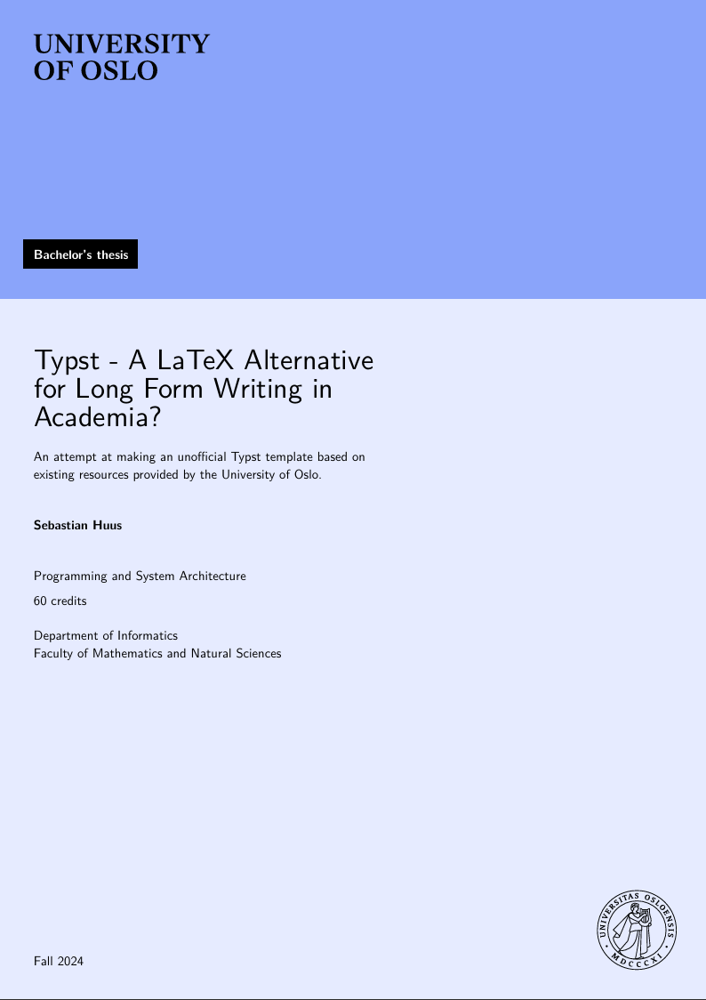

# uio-thesis

I made this template for fun because I wanted to learn Typst for a different project. I figured something like this could be useful to future students at UiO and maybe for myself if I do my master's at UiO.

Note to potential users: I think UiO handles the cover page for you, so they'll most likely ask you to submit it without a front page (which I put the most effort into for this project). However I did try to implement some nice features for the first pages and thesis structure. 

## HELP WANTED
I dunno how to put this onto Typst universe. I just use Typst's browser app, but it seems packages like this must be run locally and tested. 

I tried setting it up and running it locally but document doesn't build.

Feel free to make a pull request so we can put this on Typst Universe🙌

## Template in action

### Front page example

### Different color schemes and cover images

## Notes
- This project was made in Typst 0.12. Doesn't work in the Typst web app on 0.13. 

## Thanksies

I used this as my main reference when composing the thesis and structure:
- https://www.uio.no/om/designmanual/profilen-i-bruk/publikasjoner-og-brosjyrer/doktorgrader.html

I used Dag Langmyhr's LaTeX templates as the basis for this one. I essentially ported his LaTeX code into Typst. It was a big help
- https://www.mn.uio.no/ifi/tjenester/it/hjelp/latex/uiophdthesis-demo.pdf

Thanks to mrtz-j & co. for the UiT Typst template. I referenced it when figuring out how to set up a Typst template to begin with. Helped me figure out show.with-statements and how all that jazz is supposed to work together to make an easy to use template:
https://github.com/mrtz-j/typst-thesis-template